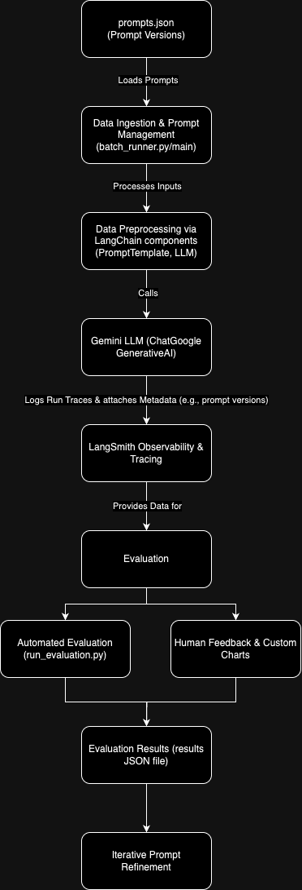
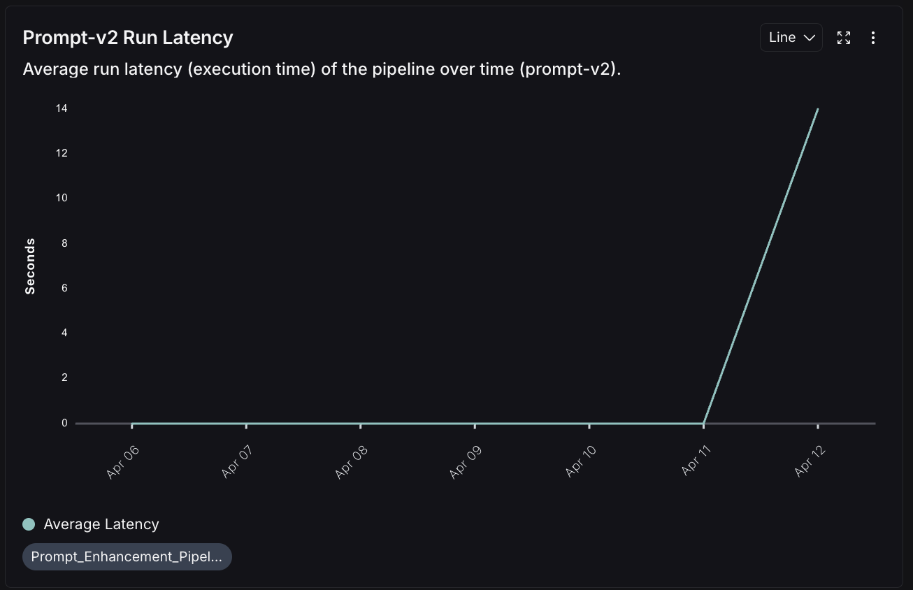
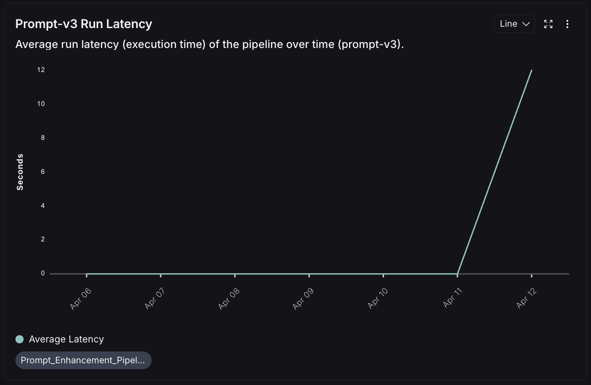
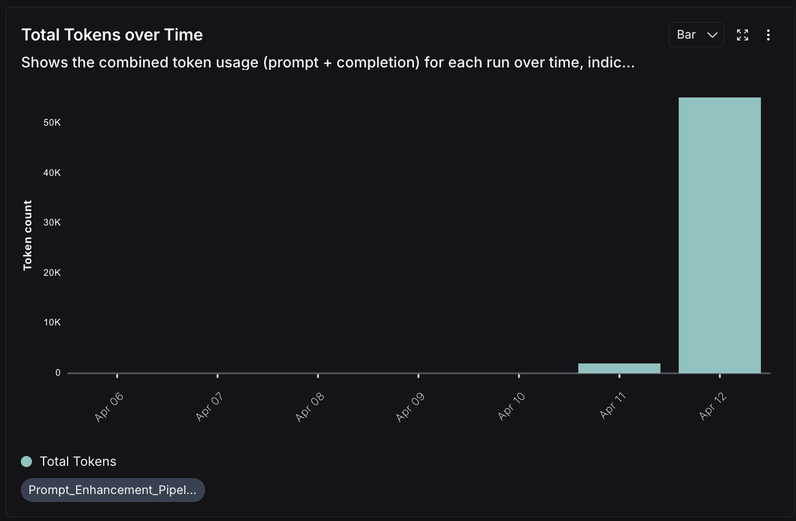
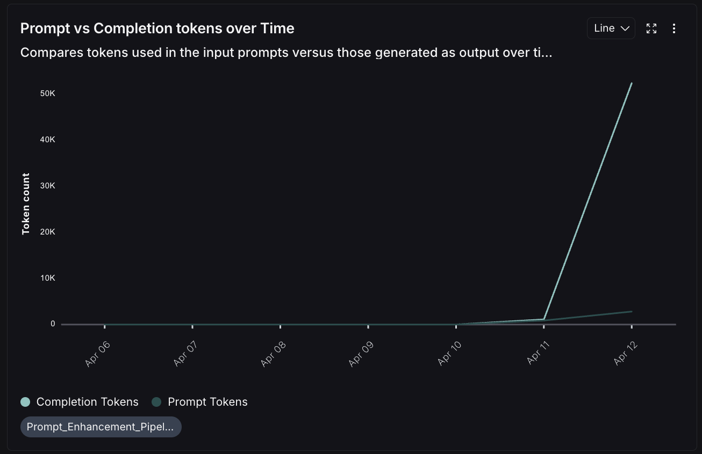
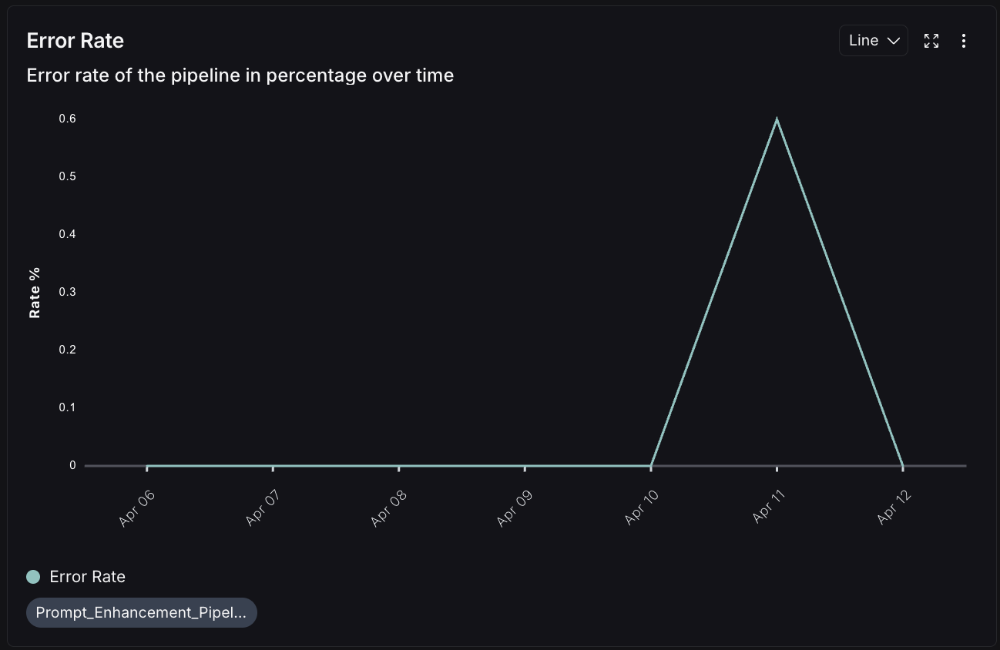

# Prompt Enhancement Pipeline Using LangSmith

## Overview
This project implements an end-to-end data pipeline to enhance and evaluate prompts for a large language model using LangChain and LangSmith. The solution ingests multiple prompt versions and a diverse evaluation dataset, processes inputs through the Gemini LLM, logs run traces to LangSmith for observability, and assesses prompt performance using both automated and human-in-the-loop evaluations.

## Key Features
- Multiple prompt versions are managed via a local prompts.json file and tagged in LangSmith for traceability.
- Data ingestion is performed using an evaluation dataset (eval_dataset.json) that contains diverse travel queries with corresponding reference outputs.
- The pipeline logs every run to LangSmith with detailed metadata such as timestamps, token usage, and prompt version tags, and custom dashboard charts monitor run latency, token usage, and error rates.
- Evaluation is conducted in two ways:
  - Human-in-the-loop feedback is gathered using custom tags (alignment, naturalness, detail) through LangSmith’s annotation interface.
  - An automated evaluation script (run_evaluation.py) computes semantic similarity between generated outputs and reference texts using cosine similarity of embeddings from SentenceTransformer.
- The setup supports iterative prompt refinement based on both manual and automated evaluations.

## Architecture
An image of the pipeline diagram is provided below. Upload your final diagram image as "diagrams/pipeline_diagram.png" in your repository.

The architecture comprises the following components:
- Data Ingestion: prompts.json stores the different prompt versions, and eval_dataset.json provides multiple user inputs along with ideal reference outputs.
- Data Processing: The pipeline (via main.py or batch_runner.py) processes inputs using LangChain (with PromptTemplate and ChatGoogleGenerativeAI) and calls the Gemini LLM.
- Observability: Each run is logged in LangSmith with detailed metadata (timestamps, token usage, prompt version tags), and custom dashboard charts visualize key metrics.
- Evaluation: Automated evaluation in run_evaluation.py calculates cosine similarity between outputs and references, and human feedback is collected via LangSmith’s annotation interface.
- Results Storage: Evaluation results are saved in files (such as results/evaluation_results.json) and can also be viewed in LangSmith.

## Setup and Usage
1. Clone the repository from GitHub.
2. Create a virtual environment and activate it.
3. Install the required dependencies using the provided requirements.txt file.
4. Configure a .env file with your API keys for LangSmith and Gemini (copy .env.example to .env and replace the placeholder values with your actual API keys.).
5. To test the pipeline, run main.py for a single run, batch_runner.py for processing multiple prompts, and run_evaluation.py for automated evaluation.

## Observability in LangSmith
The pipeline integrates with LangSmith so that:
- Each run is logged as a trace with metadata (timestamp, token usage, prompt version tags).
- Custom dashboard charts display metrics such as run latency, total token usage, and success versus error rates.
- Human feedback is provided through LangSmith’s annotation interface using custom tags.

## Evaluation Details
Human-in-the-loop Evaluation is performed using custom feedback tags:
- Alignment assesses how well the output addresses the user query.
- Naturalness evaluates the fluency and conversational tone of the output.
- Detail measures the specificity and completeness of the generated itinerary.

Automated Evaluation is implemented in run_evaluation.py, where cosine similarity between embeddings of generated outputs and reference texts is computed. The SentenceTransformer “all-MiniLM-L6-v2” model is used to derive embeddings, and cosine similarity produces scores between 0 and 1 indicating how semantically similar the output is to the reference.

Example results:
- Prompt version v1: Average automated score of approximately 0.78
- Prompt version v2: Average automated score of approximately 0.85
- Prompt version v3: Average automated score of approximately 0.90

## Dashboard Graphs & Metrics Overview

This pipeline’s observability features leverage separate charts in LangSmith to monitor core metrics. Below are the specific charts, each with a short explanation and an embedded screenshot.

---

### 1. Prompt-v1 Run Latency

- **Metric:** Average run latency (execution time) for Prompt v1.  
- **Purpose:** Helps determine how quickly Prompt v1 completes its requests, indicating whether v1 is slower or more efficient than other versions.  
- **Dashboard Graph:**
  
  
  The above line chart illustrates the latency (in seconds) over time for runs using Prompt v1.

---

### 2. Prompt-v2 Run Latency

- **Metric:** Average run latency for Prompt v2.  
- **Purpose:** Monitors execution speed specifically for Prompt v2, which may differ due to its prompt structure or instructions.  
- **Dashboard Graph:**
  
  
  This line chart shows how quickly or slowly Prompt v2 completes its runs.

---

### 3. Prompt-v3 Run Latency

- **Metric:** Average run latency for Prompt v3.  
- **Purpose:** Evaluates runtime performance for Prompt v3, allowing direct comparison with v1 and v2 latencies.  
- **Dashboard Graph:**
  
  
  This chart displays how Prompt v3’s latency fluctuates over time.

---

### 4. Total Tokens over Time

- **Metric:** Shows the combined token usage (prompt + completion) for each run.  
- **Purpose:** Understanding total token usage is key for cost management and efficiency. A sudden spike might indicate overly verbose prompts or outputs.  
- **Dashboard Graph:**
  
  
  The bar chart highlights how many tokens were consumed by each run overall.

---

### 5. Prompt vs. Completion Tokens over Time

- **Metric:** Compares tokens used in the input prompt versus those generated in the LLM’s output.  
- **Purpose:** This breakdown helps reveal if your pipeline is consuming excessive tokens in prompts or if the LLM’s outputs are excessively long.  
- **Dashboard Graph:**
  
  
  The line chart indicates prompt token counts versus completion token counts over time.

---

### 6. Error Rate

- **Metric:** Error rate of the pipeline in percentage over time.  
- **Purpose:** Reflects stability of the pipeline. A high error rate may suggest issues in prompt structures, LLM calls, or infrastructure.  
- **Dashboard Graph:**
  
  
  This chart shows what percentage of runs encountered errors, helping you track reliability trends.

## Future Improvements
- Expand the evaluation dataset to include a wider range of travel scenarios.
- Integrate native LangSmith evaluator chains for more sophisticated automated scoring.
- Explore using LangSmith’s built-in prompt management features for direct prompt versioning.
- Configure advanced alert systems for real-time monitoring of key metrics.

## Contributing
Contributions are welcome. To contribute:
- Fork the repository and create a new branch for your feature.
- Commit your changes with clear commit messages.
- Push your branch and create a pull request for review.

## License
This project is licensed under the MIT License.
